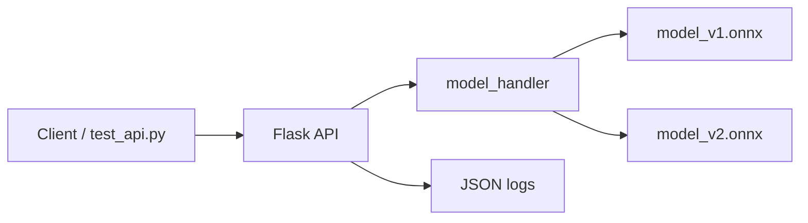

# Architecture

В проекте я выбрал модульный монолит. Для этой задачи это самый адекватный вариант: сервис получает признаки клиента, выбирает версию модели, делает предсказание и возвращает результат через API

Главная идея - не дробить проект на микросервисы просто ради микросервисов

## Текущая схема



Сейчас весь inference находится внутри одного контейнера `ml-api`

```text
client -> Flask API -> model_handler -> ONNX Runtime -> response
```

API принимает запрос, создает `request_id`, вызывает модель, пишет лог и возвращает ответ

`model_handler` занимается загрузкой моделей, выбором версии и запуском ONNX Runtime

## Почему монолит

Для текущего проекта монолит выглядит логичнее микросервисов

Сервис решает одну основную задачу:

```text
получить данные клиента -> предсказать дефолт -> вернуть вероятность
```

Если сейчас вынести загрузку модели, препроцессинг и predict в разные сервисы, архитектура станет сложнее, а пользы почти не будет

Появятся дополнительные проблемы:

* нужно будет поддерживать несколько контейнеров
* появятся сетевые вызовы между сервисами
* придется отдельно обрабатывать ошибки связи между сервисами
* сложнее станет локальный запуск
* сложнее станет проверка проекта
* для обычного `/predict` все равно придется ждать ответ от model-service

В большом production такое разделение может быть нормальным. Например, если разные команды отвечают за разные части системы, нагрузка высокая, а inference нужно масштабировать отдельно

Но для учебного проекта и одной ML-задачи это скорее лишняя сложность. Поэтому я оставил один сервис, но разделил код внутри по смыслу

То есть это не монолит, где все лежит в одном большом файле. Это один deployable service, но с нормальным разделением на API и работу с моделью

## Основные компоненты

### Flask API

В приложении есть два основных endpoint'а:

```text
GET  /health
POST /predict
```

`/health` нужен для быстрой проверки, что сервис живой

`/predict` принимает JSON с признаками клиента и возвращает:

```text
model_version
prediction
probability
request_id
```

`request_id` нужен, чтобы потом можно было связать ответ API с записью в логах

### model_handler

`model_handler` загружает ONNX-модели один раз при старте приложения:

```text
model_v1.onnx
model_v2.onnx
```

После этого при каждом запросе он выбирает нужную версию модели и делает inference

Версию модели можно выбрать двумя способами

Первый вариант - явно передать `model_version`:

```json
{
  "model_version": "v1",
  "features": [[...]]
}
```

Второй вариант - передать `client_id`. Тогда сервис сам распределит клиента между потоками:

```text
hash(client_id) % 2 == 0 -> v1
hash(client_id) % 2 == 1 -> v2
```

Так один и тот же клиент стабильно попадает в одну и ту же группу. Это уже полезно для A/B-теста, потому что клиент не будет случайно прыгать между моделями от запроса к запросу

### ONNX Runtime

Модель используется в формате ONNX. В этом проекте это удобно, потому что API работает уже с готовым inference-артефактом, а не с sklearn-объектом напрямую

Обучение остается отдельно в `model/train_model.py`, а API использует сохраненные ONNX-модели

## Docker

Сервис упакован в Docker-образ на базе `tiangolo/uwsgi-nginx-flask`

В контейнер копируются:

```text
app/
model/
requirements.txt
uwsgi.ini
```

Запуск сделан через Docker Compose. Сейчас в compose один сервис:

```text
ml-api
```

Он собирается из текущего Dockerfile и пробрасывает порт:

```text
8080:80
```

Такой вариант проще проверять. Проверяющему не нужно руками запускать несколько связанных сервисов и разбираться с очередями

## Как архитектуру можно развивать дальше

Сейчас проект реализован как модульный монолит, потому что это самый простой и понятный способ решить текущую задачу: принять запрос, выбрать модель и вернуть предсказание. Но это не означает, что архитектура не может эволюционировать.

Если со временем появятся новые требования, отдельные части системы можно вынести в самостоятельные сервисы.

Например, можно выделить сервис для работы с очередями и фоновыми задачами:

```text
Flask API -> RabbitMQ -> worker
```

* batch-предсказания для большого количества клиентов;
* асинхронная обработка тяжелых задач;
* интеграции с внешними системами;
* отправка уведомлений или запись результатов в другие хранилища;
* обработка событий без увеличения времени ответа API.

Отдельным можно выделить сервис связанный с A/B-тестированием. Сейчас логика распределения клиентов между моделями находится внутри API, что вполне достаточно для небольшой системы. Однако при росте проекта можно вынести её в отдельный сервис, который будет отвечать за:

* распределение трафика между версиями моделей;
* хранение правил экспериментов;
* изменение долей трафика без изменения кода API;
* сбор и анализ результатов экспериментов;
* управление жизненным циклом моделей.

Тогда архитектура может выглядеть следующим образом:

```text
client -> API -> A/B service -> model service
                     |
                     -> experiment storage
```

Таким образом, выбор монолита был сделан осознанно: он позволяет быстро реализовать и поддерживать решение без лишней инфраструктурной сложности. При этом текущая структура не ограничивает дальнейшее развитие. По мере появления реальных потребностей отдельные функции можно постепенно выделять в микросервисы, не переписывая систему целиком.
